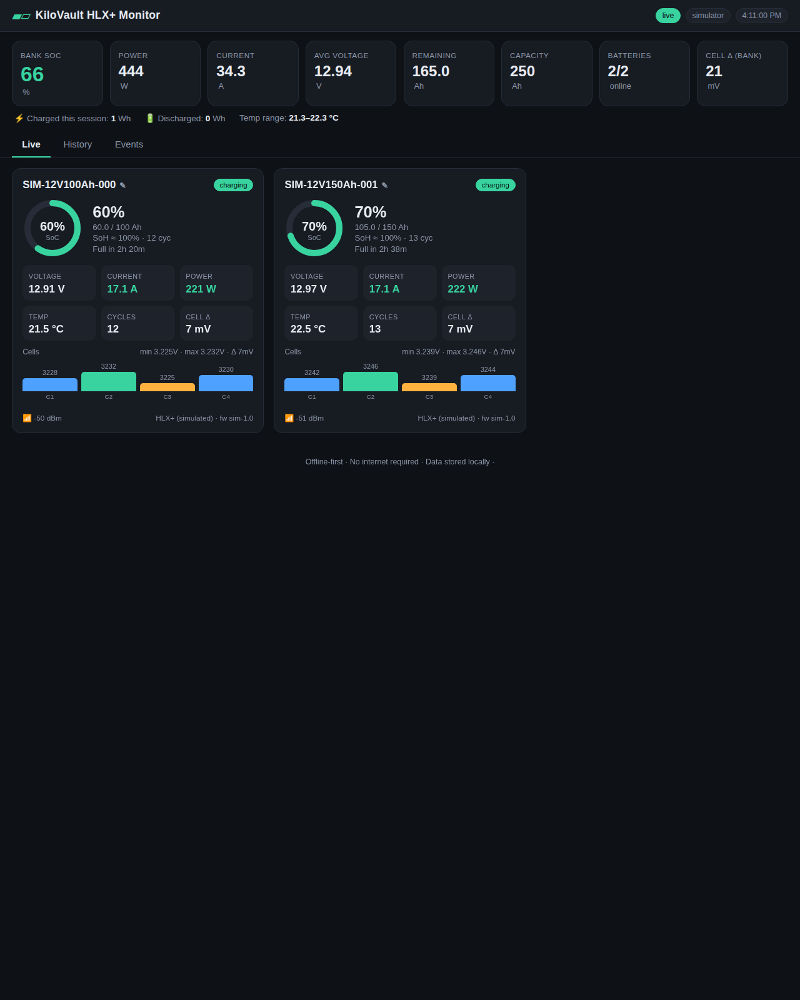

# KiloVault HLX+ Monitor

A free, **offline-first** monitoring program for **KiloVault HLX / HLX+** LiFePO4
batteries — built because KiloVault went out of business and the official
*HLX iT* phone app no longer works.

It runs on a **Windows PC** (also Linux/macOS) and talks to the batteries over
Bluetooth Low Energy, either with the PC's own Bluetooth or through a small
**ESP32 bridge** placed next to the battery bank. It needs **no internet** — ideal
for a remote cabin — and does everything the old app did, plus a lot more.



> **New here?** Read the [**Quick Start**](QUICKSTART.md) — it's written for
> non-technical users: download one file, double-click, follow the wizard.

---

## Why this exists

KiloVault HLX+ batteries contain a Bluetooth BMS (the OEM is Topband; the radio
speaks the well-known JBD/“Xiaoxiang” protocol). The vendor's app was pulled from
the app stores, leaving owners with no way to see voltage, state of charge, cell
balance or alarms. This project re-implements that — and the protocol it uses is
documented in [`docs/PROTOCOL.md`](docs/PROTOCOL.md) so it can never disappear
again.

## What it does — more than the original app

| Feature | Old HLX iT app | This monitor |
|---|---|---|
| Voltage / current / SoC / temperature | ✅ | ✅ |
| Per-cell voltages + 8 BMS alarms (HV/LV/OCC/OCD/LTC/LTD/HTC/HTD) | ✅ | ✅ |
| Rename batteries | ✅ | ✅ |
| **Whole-bank dashboard** (all batteries at once) | ❌ (one at a time) | ✅ |
| **Saved history & charts** | ❌ ("not saved into any history") | ✅ SQLite + charts |
| **Power, energy (Wh in/out), coulomb counting** | ❌ | ✅ |
| **Time-to-full / time-to-empty** | ❌ | ✅ |
| **Cell-balance analytics** (Δ over time, min/max cell) | ❌ | ✅ |
| **Configurable alarms + sound + desktop + log** | ❌ | ✅ |
| **State-of-Health estimate** | ❌ | ✅ |
| **CSV export** | ❌ | ✅ |
| **Runs headless / on a server, reachable from your phone** | ❌ | ✅ |
| **Phone access via scannable QR code + installable web app** | ❌ | ✅ (offline QR) |
| **Standalone Raspberry Pi touchscreen cabin box** | ❌ | ✅ |
| **Guided setup wizard + connection diagnostics page** | ❌ | ✅ |
| **In-app tooltips + glossary (plain-language help)** | ❌ | ✅ |
| **Troubleshooting log + one-click diagnostics bundle** | ❌ | ✅ |
| **One-file double-click app (no Python needed)** | — | ✅ (Windows .exe) |
| **Works with no internet** | ✅ | ✅ |
| **No vendor account / cloud** | — | ✅ |

## Easiest start — the double-click app (Windows)

Download `KiloVaultMonitor.exe` (Releases, or build it — see
[`docs/USAGE.md`](docs/USAGE.md#packaging)), **double-click it**, and follow the
setup wizard. No Python, no command line. Full walkthrough in the
[**Quick Start**](QUICKSTART.md).

## Quick start — try it with no hardware

The whole app (dashboard, charts, logging, alarms) runs on a bare Python 3.11+
with **no dependencies** thanks to a built-in simulator:

```bash
python -m kilovault.cli serve --simulate --open
```

Open <http://127.0.0.1:8765>. You'll see two simulated batteries charging and
discharging, with live charts and alarms. A **setup wizard** greets you on first
run; every number has an **ⓘ tooltip**, and the **Diagnostics** tab helps when a
connection misbehaves.

## Use it with real batteries

1. Install Python 3.11+ and the Bluetooth library:

   ```bash
   pip install bleak           # or: pip install -r requirements.txt
   ```

2. Wake the batteries (apply a load or charger) and scan:

   ```bash
   python -m kilovault.cli scan
   ```

3. Start the dashboard:

   ```bash
   python -m kilovault.cli serve
   ```

   To reach it from your phone on the cabin's Wi-Fi, bind to the LAN:

   ```bash
   python -m kilovault.cli serve --host 0.0.0.0
   ```

   then browse to `http://<the-pc-ip>:8765` from any device.

### No Bluetooth on the PC? Use an ESP32

Flash the bridge in [`firmware/esp32_bridge`](firmware/esp32_bridge) onto any
ESP32, plug it into the PC, and:

```bash
python -m kilovault.cli serve --serial COM3      # /dev/ttyUSB0 on Linux
```

The ESP32 can sit right next to the battery bank (BLE range ~100 m line-of-sight)
with just a USB cable back to the PC. See [`docs/HARDWARE.md`](docs/HARDWARE.md).

## Cabin box — a standalone Raspberry Pi with a touchscreen

Want an always-on appliance by the batteries with a small touchscreen and phone
access? Flash a Pi, run one installer, and it boots straight into a full-screen
dashboard and reconnects on its own — no internet, ever.

```bash
git clone https://github.com/LstDtchMn/Solar-Battery-App.git ~/Solar-Battery-App
cd ~/Solar-Battery-App && sudo bash deploy/install-pi.sh
```

**No Wi-Fi in the cabin?** The Pi can broadcast **its own network** so your phone
connects directly (no router) — `deploy/setup-hotspot.sh`. Joining it **auto-opens
the dashboard** (captive portal). The touchscreen is **customizable** (📺 Screen:
bank / fleet / giant charge % / single-battery, plus text size and light theme),
alarm thresholds and logging are editable in-app (**⚙ Settings**, no config file),
and a 📱 QR code opens the dashboard on your iPhone without typing.

Full walkthrough (SD imaging, hotspot, kiosk, screen layouts, iPhone "Add to
Home Screen", watchdog, siren alerts, SD-card longevity):
[**`docs/CABIN.md`**](docs/CABIN.md).

## Commands

```
kvmon serve [--simulate] [--serial PORT] [--host H] [--port P] [--open]
kvmon scan [--timeout S]          discover nearby HLX+ batteries
kvmon monitor [--simulate]        headless console monitor
kvmon export out.csv [--address]  dump logged history to CSV
kvmon init-config                 write a documented config.toml
```

(`kvmon` is installed by `pip install .`; otherwise use `python -m kilovault.cli`.)

## Configuration

Everything has sensible defaults. To customise (thresholds, transport, LAN
binding, data location) generate a template:

```bash
python -m kilovault.cli init-config
```

and edit `config.toml`. See [`docs/USAGE.md`](docs/USAGE.md) for the full list.

## How it's built

```
kilovault/
  protocol.py      frame assembly / decode / encode (pure, fully tested)
  models/config    data types and TOML config
  transports/      ble (bleak) · serial_bridge (ESP32) · simulator
  storage.py       SQLite time-series + device registry + event log
  estimator.py     power, energy, SoH, time-to-full/empty, bank totals
  alarms.py        BMS-flag + threshold alarms, hysteresis, notifications
  manager.py       collector that ties it all together
  server/          dependency-free web dashboard (asyncio HTTP + SSE)
firmware/esp32_bridge/   NimBLE firmware for the optional ESP32 bridge
docs/PROTOCOL.md   the reverse-engineered BLE protocol
```

Design choices for a remote, off-grid install:

- **Standard-library only** for the core — the dashboard, logging, charts and
  alarms need no pip packages. Bluetooth (`bleak`) and the serial bridge
  (`pyserial`) are optional extras. Fewer dependencies = less to break.
- **All assets bundled** — the dashboard's charts are hand-written canvas (no
  CDN, no Chart.js download). Nothing phones home.
- **Read-only** — the monitor only subscribes to status notifications; it never
  writes to the pack's BMS.

## Packaging a Windows .exe

```bash
pip install pyinstaller bleak pyserial
pyinstaller --onefile --name KiloVaultMonitor ^
    --add-data "kilovault/server/static;kilovault/server/static" ^
    -c run.py
```

(`run.py` is a one-liner: `from kilovault.cli import main; main()`.) See
[`docs/USAGE.md`](docs/USAGE.md#packaging).

## Tests

```bash
pip install pytest
pytest -q
```

## Protocol & credits

The BLE protocol is documented in [`docs/PROTOCOL.md`](docs/PROTOCOL.md). It was
reconstructed from the HLX+ manual and the community reverse-engineering work of
`fancygaphtrn`'s ESPHome `kilovault_bms_ble` component and `alexphredorg/kvbms`.
This project re-implements that knowledge as a standalone, offline desktop app.

## Disclaimer

This is an unofficial, community tool, not affiliated with KiloVault. It reads
data only and is provided “as is”. Always verify critical readings (especially
before working on the system) with a real voltmeter — as the original manual
itself advised.

## License

MIT — see [`LICENSE`](LICENSE).
